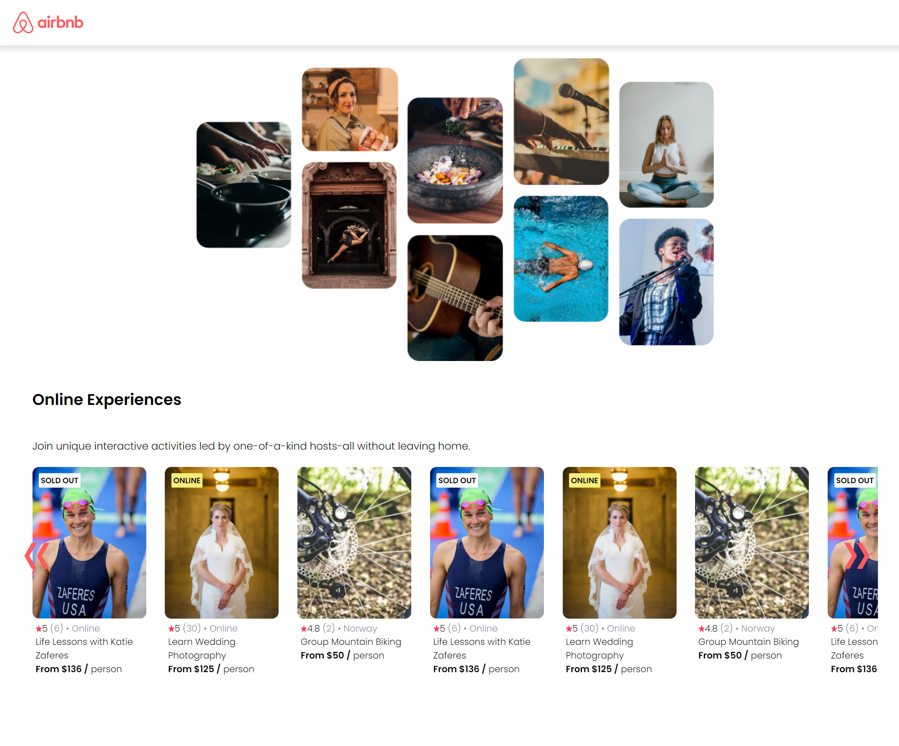

# AirBnB Template

This project is a simple template inspired by AirBnB's design, built with Vite for fast and efficient development. It is a clean, responsive layout meant to replicate key aspects of the AirBnB interface, providing a solid foundation for building similar web applications.

## Table of Contents

- [Features](#features)
- [Technologies Used](#technologies-used)
- [Installation](#installation)
- [Usage](#usage)
- [Contributing](#contributing)

## Features

- Responsive design inspired by AirBnB
- Fast and optimized development with Vite
- Modular components for easy customization

## Technologies Used

- Vite
- React
- HTML/CSS
- JavaScript

## Installation

Follow these steps to set up the project locally:

1. Clone the repository:
   `git clone https://github.com/Griffinov22/air-bnb-template.git`

2. Navigate to the project directory:
   `cd air-bnb-template`

3. Install dependencies:
   `npm install`

4. Start the development server:
   `npm run dev`

---

This project was built as a learning exercise using Vite and is open for improvements and further development.
